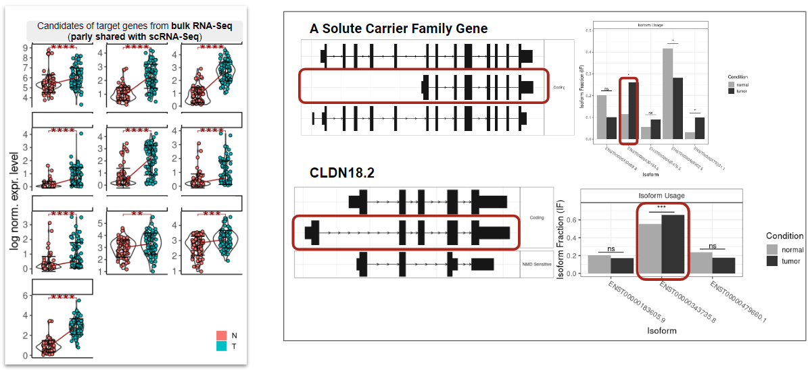

# Identifying Target Genes from High-Throughput Sequencing Data
The `kure.ai` lab launched an an in-silico pipeline development to explore potential biomarkers in human gastric cancer NGS data which will be expanded to the other cancer types later

The `kure.ai` target discovery solution begins with unbiased high-throughput human sequencing data. It identifies a group of biomarkers underlying a similar cancer development mechanism through a deterministic interpretable machine learning method.

### SDLC pipeline development in progress
The `kure.ai` target discovery pipeline is agile and data-driven. The initial search considers multiple factors. Any gene enriched into critical organs is filtered out.

[1] 

### Unbiased data-driven approach
For a prototype design, we chose a stomach cancer and compiled 1027 bulk RNA-Seq samples from 10 gastric cancer cohorts and nearly ~1M cells from 10 scRNA-Seq cohorts.

[2]

### Transforming the tremendous data into meaningful data
At each cancer development stage, the pipeline identified 3 to 7 genes to target in malignant epithelial cells supported by multiple scRNA-Seq cohorts. Those include genes encoding surface proteins and druggable.

[3]

### A deep learning method to refine the target genes
Initial candidates are expanded with the bulk RNA-Seq cohorts including the genes (including a distinct isoform usage e.g., *CLDN18.2*) regulating cell adhesion or junction property. A part of genes in [3] is also identified in the bulk RNA-Seq cohorts. Currently, we are developing an AI method to combine the tumor microenvironment with the target candidates to determine driver genes governing the upstream of cancer development.

[4] 
